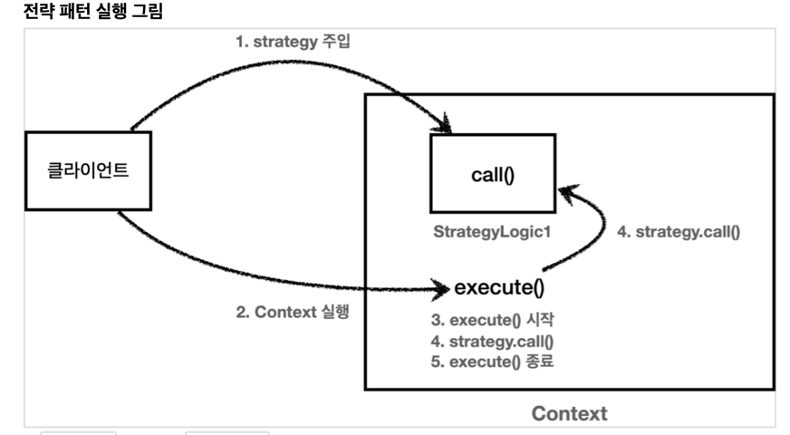

Z

# 1. 템플릿 메서드 패턴

```java

public abstract class  Template<T> {

  abstract T template();

  public void execute(){
    System.out.println("---------시작--------");
    template();
    System.out.println("---------끝--------");
  }

}

```
## 장점
- ### 변하는 부분과 변하지 않는 부분을 구분하여 `단일책임을 구현`할 수 있다.
- ### 변하지 않는 부분은 한 곳에서 수정할 수 있어 `변경에 용이`하다.
## 단점
- ### 상속을 통해 구현되기 때문에 `상속으로 인한 단점`들을 그대로 가지고 간다.
- ### 부모 클래스의 기능을 사용하지 않음에도 `강력한 의존관계`를 가지고 있다는게 단점이다.
## 단점을 개선한 패턴
- ### 전략패턴

# 2. 전략패턴




## 사용
```java
public void test () {

  //Strategy를 구현한 익명 클래스
  Strategy strategy = () -> System.out.println("실행 될 함수");

  ContextV1 contextV1 = new ContextV1(strategy);

  contextV1.execute();

}
```
## 부연
- ### 선조립, 후실행 -> 문맥과 실행될 코드가 조합이 되고 나서 실행되는 부분.
## 장점
- ### 템플릿 메서드 패턴과 달리 상속없이 인터페이스로 구현하여 `상속으로 인한 단점이 없다`.
## 단점
- ### context 와 strategy를 조립한 이후에는`전략을 변경하기가 번거롭다.`
- ### 위같은 단점을 아래같은 코드로 변경한다면 전략변경에 어느정도 용이하다.
```java

// 실행할 함수를 parameter로 받는다.
public class ContextV2 {

  public void execute(Strategy strategy){
    System.out.println("실행전===========");
    strategy.call();
    System.out.println("실행후===========");
  }

}
```

